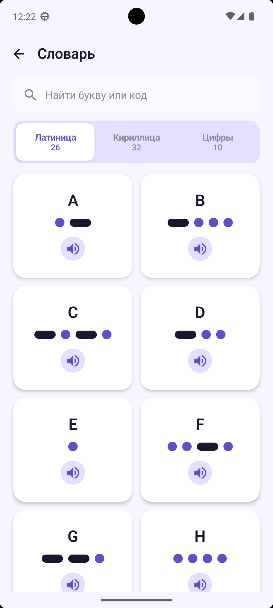
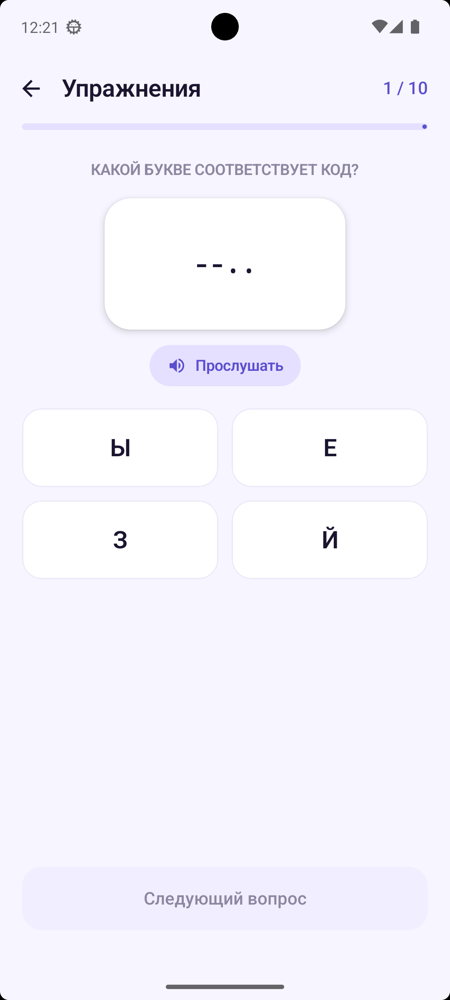
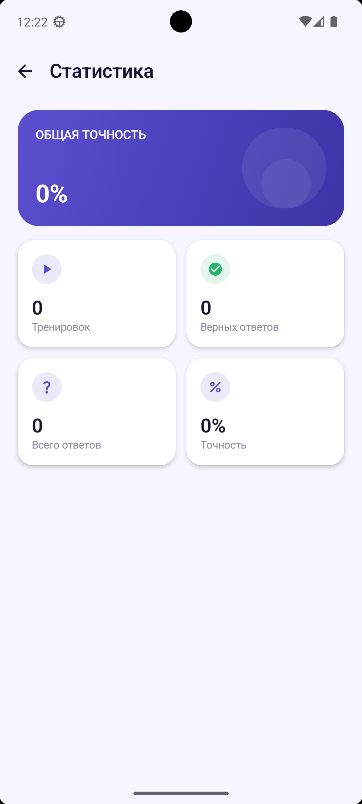
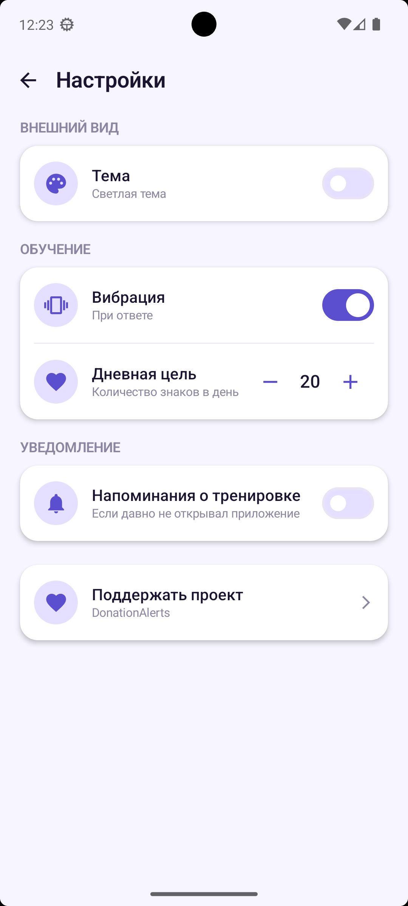

# DotDash

**DotDash** — Android-приложение для изучения азбуки Морзе через словарь, короткие тренировки и систему ежедневного прогресса.

Приложение помогает:
- изучать символы Морзе в словаре;
- закреплять знания в формате мини-тренировок;
- отслеживать статистику;
- поддерживать регулярность с помощью локальных напоминаний.

---

## Возможности

### Главный экран
- дневная цель;
- прогресс за сегодня;
- количество выученных символов;
- общая точность;
- время тренировок за день.

### Словарь
- латиница;
- кириллица;
- цифры;
- воспроизведение кода Морзе для каждого символа.

### Тренировки
- серия вопросов с выбором правильного ответа;
- подсветка результата:
  - правильный ответ — зелёный;
  - неверно выбранный — красный;
- локальная статистика по завершении тренировки.

### Статистика
- количество тренировок;
- количество верных ответов;
- общее количество ответов;
- точность.

### Настройки
- светлая / тёмная тема;
- вибрация при ответе;
- дневная цель;
- локальные напоминания о тренировках.

### Напоминания
- реализованы через `WorkManager`;
- работают без сервера, FCM и push-платформ;
- уведомление приходит, если пользователь давно не открывал приложение.

---

## Скриншоты

### Главный экран

### Словарь

### Тренировка

### Статистика

### Настройки

---

## Технологии

- **Kotlin**
- **Jetpack Compose**
- **Material 3**
- **MVVM**
- **Coroutines**
- **Flow / StateFlow**
- **DataStore**
- **WorkManager**

---

## Архитектура

Проект построен с разделением на слои:

- `presentation` — экраны, `ViewModel`, UI-state;
- `domain` — модели и интерфейсы репозиториев;
- `data` — DataStore, repository implementation, локальные источники данных.

Основные подходы:
- UI построен на **Jetpack Compose**;
- состояние экранов управляется через **ViewModel**;
- настройки и статистика сохраняются через **DataStore**;
- локальные напоминания реализованы через **WorkManager**.

---

## Как работает приложение

### Прогресс
После завершения тренировки сохраняются:
- количество правильных ответов;
- общее количество ответов;
- длительность сессии;
- выученные символы;
- дневной прогресс.

### Дневная цель
Пользователь может менять дневную цель в настройках.  
Главный экран показывает текущий прогресс относительно этой цели.

### Локальные уведомления
Если напоминания включены, приложение периодически проверяет дату последнего открытия и может показать локальное уведомление с напоминанием о тренировке.

---

## Статус проекта

Проект подготовлен к первому релизу

---

## Планы по развитию

- дополнительные режимы тренировок;
- расширение статистики;
- улучшение визуализации словаря;
- более гибкие настройки напоминаний.

---

## Запуск проекта

1. Клонировать репозиторий
2. Открыть проект в **Android Studio**
3. Собрать и запустить приложение на устройстве или эмуляторе

---

## Автор

Елена Пупышева
